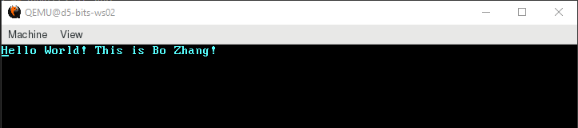
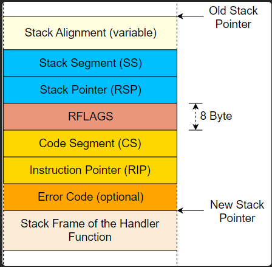

# 感谢
https://os.phil-opp.com/zh-CN/

- [感谢](#感谢)
    - [1. no\_std](#1-no_std)
    - [2. 最小内核](#2-最小内核)
    - [3. VGA字符模式](#3-vga字符模式)
    - [4. 测试内核](#4-测试内核)
    - [5. CPU异常处理](#5-cpu异常处理)
      - [中断描述符表(IDT)](#中断描述符表idt)
      - [中断调用约定](#中断调用约定)
      - [保留寄存器和临时寄存器](#保留寄存器和临时寄存器)
      - [保存所有寄存器数据](#保存所有寄存器数据)
      - [中断栈帧](#中断栈帧)
      - [编码实现](#编码实现)

### 1. no_std
* 初识no_std，要自行处理panic（panic_handler），在Cargo.toml里配置`panic = "abort"`可禁用栈展开。  
* `#![no_main]`后`extern "C" fn _start()`作为程序入口，用`#[no_mangle]`防止函数重命名  
* x86_64-unknown-linux-gnu，它包含了 CPU 架构 x86_64 、供应商 unknown 、操作系统 linux 和二进制接口 gnu

### 2. 最小内核
引导启动过程:
* 启动时主板ROM固件将会：加电自检，可用内存，CPU及其它硬件预加载
* 寻找一个可引导的存储介质，启动存储在介质开头的第一阶段引导程序（512字节以内），然后加载更长的第二阶段引导程序
* 引导程序 1.决定内核的位置，并将内核加载到内存
* 引导程序 2.还需要将 CPU 从 16 位的实（real mode）模式，先切换到 32 位的保护模式（protected mode），最终切换到 64 位的长模式（long mode），这时所有的 64 位寄存器和整个主内存才能被访问
* 引导程序 3.将BIOS 查询特定的信息，并将其传递到内核
  
固件分两种： BIOS（Basic Input/Output System）和 UEFI（Unified Extensible Firmware Interface），BIOS比较落后，练习都用的BIOS

Multiboot 标准: 一个引导程序标准，在内核文件开头插入要求的数据片段即可，此次实验暂不支持  
  
通常状况下，core crate以预编译库（precompiled library）的形式与 Rust 编译器一同发布，但对于咱们自定义系统需要重新编译，`build-std = ["core", "compiler_builtins"]`  
  
内存相关的memset/memcopy一般需要操作系统相关的标准C库，咱们用`compiler_builtins`提供的即可`build-std-features = ["compiler-builtins-mem"]`
  
安装QEMU 虚拟机  
  
dependencies引入`bootloader`不需要自己编写引导程序，`cargo bootimage`先编译内核在编译引导程序`bootloader`，最终拼接成一个可引导的磁盘映像

`TBD`: 用Moba启动了远程图形界面，但是有一个关于虚表的警告不知道后续有没有影响，好像本地编译QEMU能解决
> GLib-WARNING **: gmem.c:483: custom memory allocation vtable not supported
  

  
### 3. VGA字符模式
存储器映射输入输出（memory-mapped I/O）可以让我们像操作普通的内存区域一样操作VGA字符缓冲区（0xb8000）  
为避免编译器优化掉这个看似无用的写操作，引入了volatile crate，实际是封装了core::ptr::write(read)_volatile  
  
一个字符单元是一个u16，低位u8：ASCII，高位u8：颜色  

lazy_static可用在no_std，once_cell还不行  
no_std锁有lock_api和spin，这里选用简单易用的spin   

### 4. 测试内核
使用`custom_test_frameworks`自定义测试框架来应对`no_std`，它的工作原理是收集所有标注了 #[test_case]属性的函数，然后将这个测试函数的列表作为参数传递给用户指定的runner函数（test_runner）。它会生成一个main函数来调用test_runner，但由于`no_main`会忽略main函数，我们需要通过 reexport_test_harness_main属性来将生成的函数的名称更改为与main不同的名称（test_main）。然后自行在_start中调用test_main。  
关闭操作系统通常实现对电源管理标准的支持，这里取巧用QEMU支持的一种名为 isa-debug-exit 的特殊设备，可指定端口发退出码可退出QEMU。  
在x86平台上，CPU和外围硬件通信通常有两种方式，内存映射I/O和端口映射I/O。之前用内存映射方式访问VGA文本缓冲区  
端口映射I/O使用独立的I/O总线来进行通信。每个外围设备都有一个或数个端口号。CPU采用了特殊的in和out指令来和端口通信，这些指令要求一个端口号和一个字节的数据作为参数  
  
测试结果输出到串口，再通过bootimage设置串口输出到stdout，很巧妙！  
  
### 5. CPU异常处理
在x86架构中，存在20种不同的CPU异常类型，以下为最重要的几种：
* Page Fault: 页错误是被非法内存访问触发的，例如当前指令试图访问未被映射过的页，或者试图写入只读页。
* Invalid Opcode: 该错误是说当前指令操作符无效，比如在不支持SSE的旧式CPU上执行了 SSE 指令。
* General Protection Fault: 该错误的原因有很多，主要原因就是权限异常，即试图使用用户态代码执行核心指令，或是修改配置寄存器的保留字段。
* Double Fault: 当错误发生时，CPU会尝试调用错误处理函数，但如果 在调用错误处理函数过程中 再次发生错误，CPU就会触发该错误。另外，如果没有注册错误处理函数也会触发该错误。
* Triple Fault: 如果CPU调用了对应 Double Fault 异常的处理函数依然没有成功，该错误会被抛出。这是一个致命级别的 三重异常，这意味着我们已经无法捕捉它，对于大多数操作系统而言，此时就应该重置数据并重启操作系统。
   
#### 中断描述符表(IDT)
我们需要设置一个 `中断描述符表 (Interrupt Descriptor Table, IDT)` 来提供异常处理函数。每个异常都具有一个预定义的IDT序号。  
通常而言，当异常发生时，CPU会执行如下步骤：

1. 将一些寄存器数据入栈，包括指令指针以及 RFLAGS 寄存器。
2. 读取中断描述符表（IDT）的对应条目，比如当发生 page fault 异常时，调用14号条目。
3. 判断该条目确实存在，如果不存在，则触发 double fault 异常。
4. 如果该条目属于中断门（interrupt gate，bit 40 被设置为0），则禁用硬件中断。
5. 将 GDT 选择器载入代码段寄存器（CS segment）。
6. 跳转执行处理函数
  
与其创建我们自己的IDT类型映射，不如直接使用 x86_64 crate 内置的 InterruptDescriptorTable 结构。
```rust
 pub struct InterruptDescriptorTable {
    pub breakpoint: Entry<HandlerFunc>,
    ...
 }

 type HandlerFunc = extern "x86-interrupt" fn(_: InterruptStackFrame);
```
#### 中断调用约定
指定了函数调用的详细信息，比如可以指定函数的参数存放在哪里（寄存器，或者栈，或者别的什么地方）以及如何返回结果。在 x86_64 Linux 中，以下规则适用于C语言函数（指定于 System V ABI 标准）：

* 前六个整型参数从寄存器传入 rdi, rsi, rdx, rcx, r8, r9
* 其他参数从栈传入
* 函数返回值存放在 rax 和 rdx
#### 保留寄存器和临时寄存器
调用约定将寄存器分为两部分：保留寄存器 和 临时寄存器 。
`保留寄存器（callee-saved）`：在被调函数返回前要恢复到初始值。在函数开始时将这类寄存器的值存入栈中，并在返回之前将之恢复到寄存器中。  
rbp, rbx, rsp, r12, r13, r14, r15
`临时寄存器（caller-saved）`：被调函数可以随意写入不必恢复，调用者如果希望此类寄存器在函数调用后保持数值不变，则需要自己来处理备份和恢复过程（例如将其数值保存在栈中）  
rax, rcx, rdx, rsi, rdi, r8, r9, r10, r11  
大多数函数的汇编指令都以 push rbp 开头，也就是将 rbp 的值备份到栈中
#### 保存所有寄存器数据
区别于函数调用，异常在执行 任何 指令时都有可能发生，所以我们无法预先保存寄存器，无法使用依赖调用方备份 (caller-saved) 的寄存器的调用传统作为异常处理程序。  
因此，我们需要一个保存所有寄存器的传统。x86-interrupt 恰巧就是其中之一，它可以保证在函数返回时，寄存器里的值均返回原样。  
Note：并不意味着所有寄存器都会在进入函数时备份入栈。编译器仅会备份被函数覆写的寄存器，继而为只使用几个寄存器的短小函数生成高效的代码。
#### 中断栈帧
当一个常规函数调用发生时（使用 call 指令），CPU会在跳转目标函数之前，将返回地址入栈。当函数返回时（使用 ret 指令），CPU会在跳回目标函数之前弹出返回地址。  
对于错误和中断处理函数，仅仅压入一个返回地址并不足够，因为中断处理函数通常会运行在一个不那么一样的上下文中（栈指针、CPU flags等等）。  
所以CPU在遇到中断发生时是这么处理的：  
1. 对齐栈指针: 任何指令都有可能触发中断，所以栈指针可能是任何值，而部分CPU指令（比如部分SSE指令）需要栈指针16字节边界对齐，因此CPU会在中断触发后立刻为其进行对齐。
2. 切换栈 （部分情况下）: 当CPU特权等级改变时，例如当一个用户态程序触发CPU异常时，会触发栈切换。该行为也可能被所谓的 中断栈表 配置，在特定中断中触发，关于该表，我们会在下一篇文章做出讲解。
3. 压入旧的栈指针: 当中断发生后，栈指针对齐之前，CPU会将栈指针寄存器（rsp）和栈段寄存器（ss）的数据入栈，由此可在中断处理函数返回后，恢复上一层的栈指针。
4. 压入并更新 RFLAGS 寄存器: RFLAGS 寄存器包含了各式各样的控制位和状态位，当中断发生时，CPU会改变其中的部分数值，并将旧值入栈。
5. 压入指令指针: 在跳转中断处理函数之前，CPU会将指令指针寄存器（rip）和代码段寄存器（cs）的数据入栈，此过程与常规函数调用中返回地址入栈类似。
6. 压入错误码 （针对部分异常）: 对于部分特定的异常，比如 page faults ，CPU会推入一个错误码用于标记错误的成因。
7. 执行中断处理函数: CPU会读取对应IDT条目中描述的中断处理函数对应的地址和段描述符，将两者载入 rip 和 cs 以开始运行处理函数。
  

  
#### 编码实现
今天的目标是实现CPU为 breakpoint 中断，即给 breakpoint exception 添加处理函数。  
当程序员为程序打上断点，调试器会将对应的位置覆写为 int3 指令，CPU执行该指令后，就会抛出 breakpoint exception 异常。
在调试完毕，需要程序继续运行时，调试器就会将原指令覆写回 int3 的位置。
